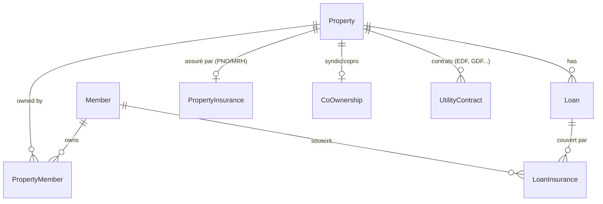
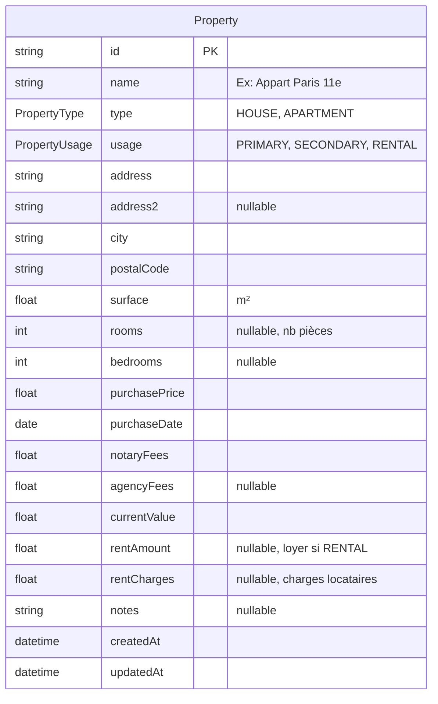
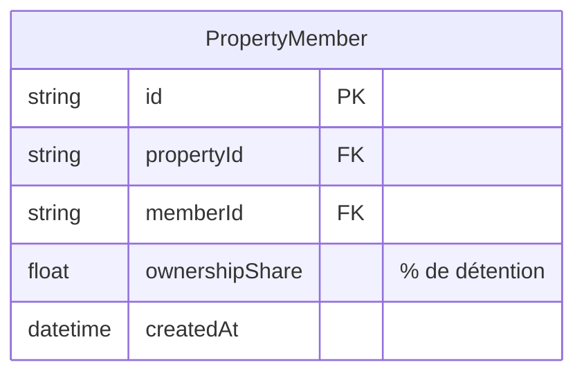
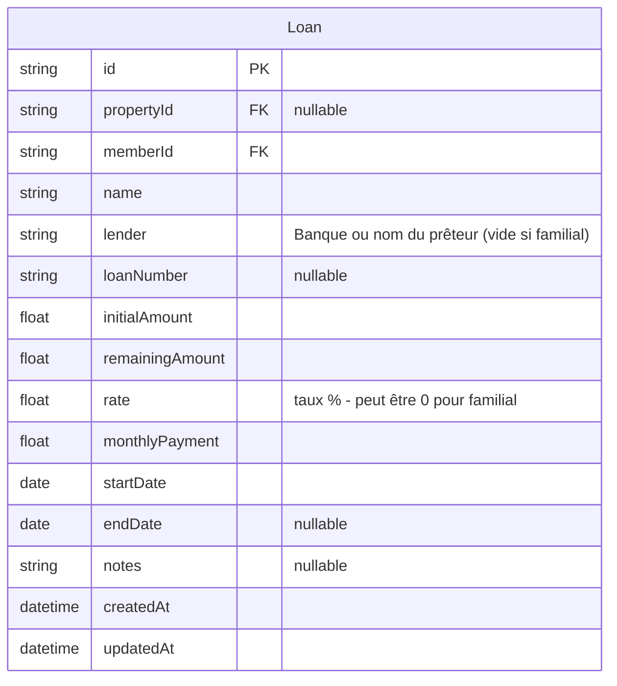
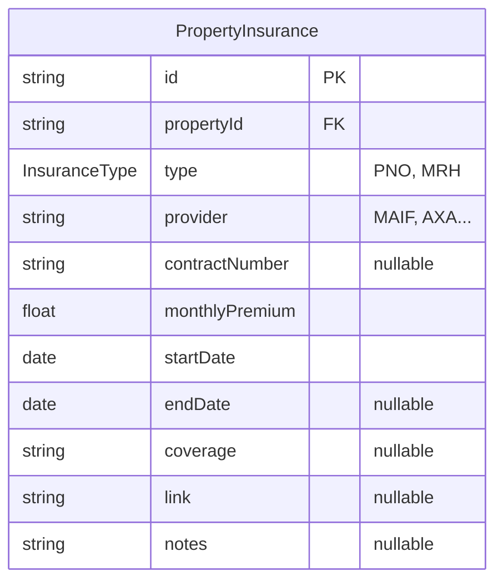
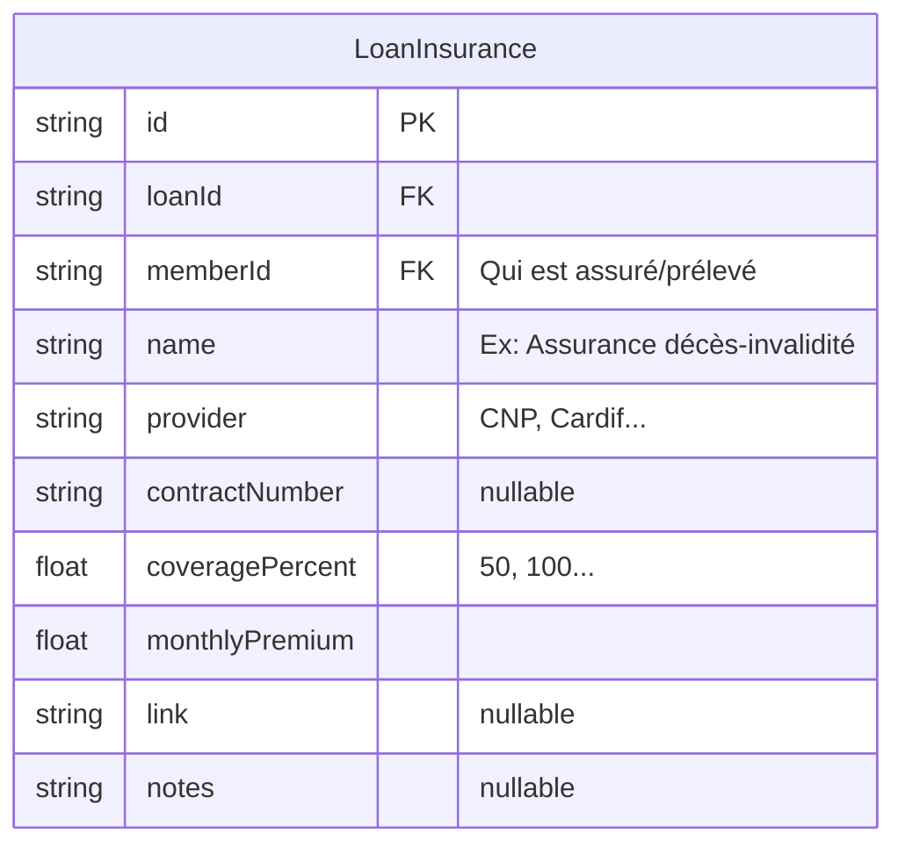
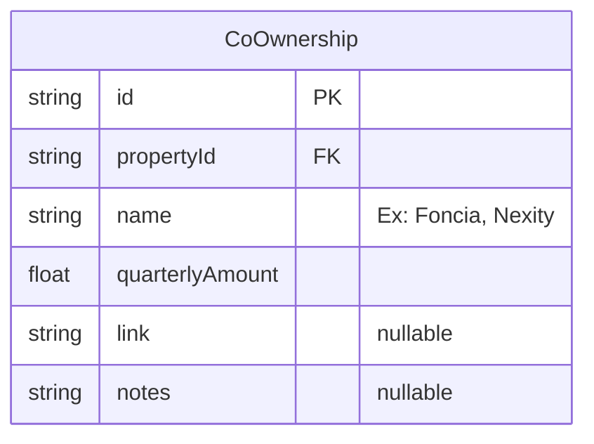
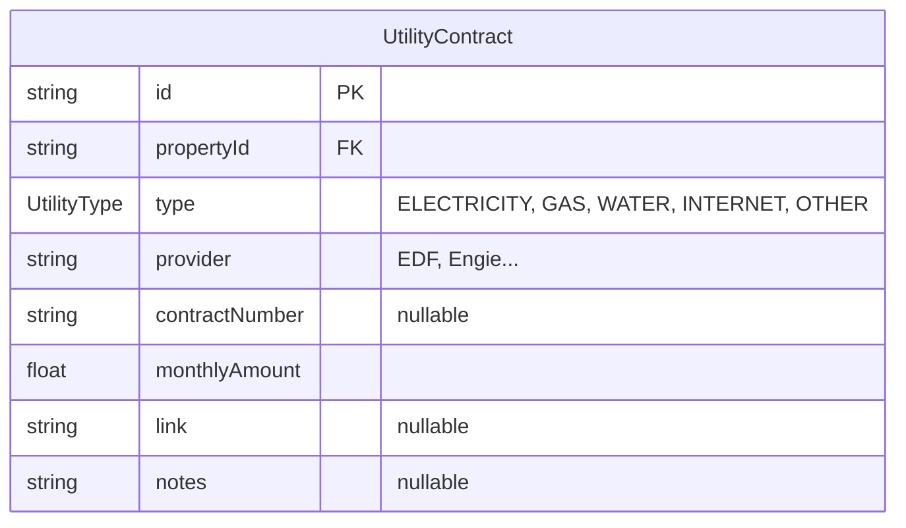
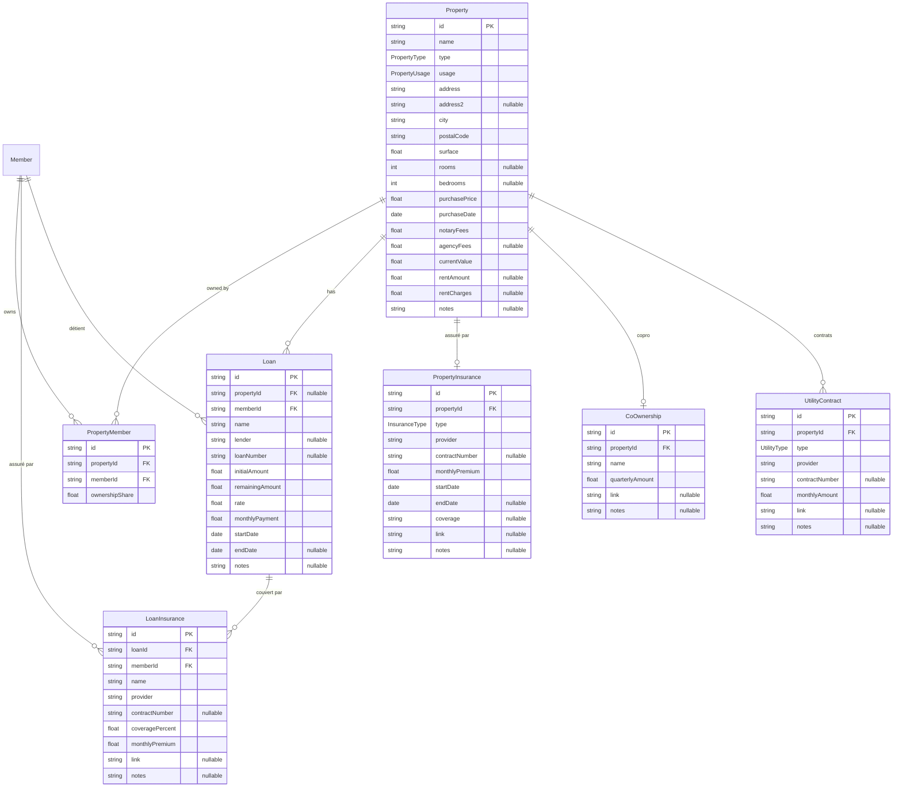

# Design Data Model - Immobilier

## Vue d'ensemble



---

## Entités principales

### Property



### PropertyMember (copropriété entre membres)



### Loan



---

## Assurances, Charges, Contrats

### PropertyInsurance (PNO/MRH) - 1:1 avec Property



### LoanInsurance (assurance emprunteur) - N par Loan, liée à 1 Member



### CoOwnership (syndic/copro) - 1:1 avec Property



### UtilityContract (EDF, GDF, eau, internet...) - N par Property



---

## Enums

```typescript
enum PropertyType {
  HOUSE       // Maison
  APARTMENT   // Appartement
}

enum PropertyUsage {
  PRIMARY     // Résidence principale
  SECONDARY   // Résidence secondaire
  RENTAL      // Investissement locatif
}

enum InsuranceType {
  PNO   // Propriétaire Non Occupant (locatif)
  MRH   // Multirisque Habitation (résidence)
}

enum UtilityType {
  ELECTRICITY
  GAS
  WATER
  INTERNET
  OTHER
}
```

---

## Décisions de design

| Aspect | Décision |
|--------|----------|
| Tenant/Locataire | Pas de table dédiée, juste `rentAmount` et `rentCharges` sur Property |
| LoanType | Supprimé - `lender` vide = prêt familial |
| Loan.insuranceMonthly | Supprimé - géré via LoanInsurance (plus flexible, multi-assuré) |
| PropertyValuation | Pas d'historique - juste `currentValue` sur Property |
| PropertyInsurance | 1:1 avec Property (un seul contrat PNO ou MRH) |
| CoOwnership | 1:1 avec Property, montant trimestriel uniquement |
| LoanInsurance | Lié à Loan ET Member (chaque co-emprunteur a sa ligne) |

---

## Modèle complet validé



---

## Status

- [x] Property - validé
- [x] PropertyMember - validé
- [x] Loan - validé
- [x] PropertyInsurance (PNO/MRH) - validé
- [x] LoanInsurance (assurance emprunteur) - validé, FK directe vers Loan + Member
- [x] CoOwnership (syndic) - validé
- [x] UtilityContract (EDF, GDF...) - validé
- [x] Enums - validés

**Prêt pour le PRD !**
